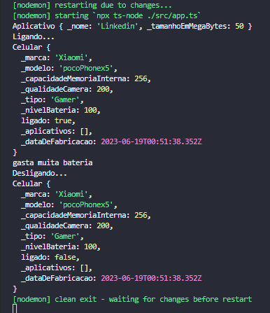
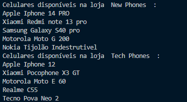

# Programação Orientada a Objetos com TypeScript

## Abstração
1. Criar uma classe para que a partir dela seja possível instanciar animais.Um animal deve ter um nome, cor, raça, peso, idade.Além dessas características, um animal deve emitir sons e se locomover.

<h5> Projeto - ./src/Models/Animais.ts </h5>


```typescript

// NOME DE CLASSE SEMPRE COMEÇANDO COM LETRA MAIUSCULA
// CLASSE ANIMAIS

export class Animal {
  Nome: String;
  Cor: String;
  Raca: String;
  Peso: Number;
  Idade: Number;

  emitirSons(Som: String) {
    console.log(this.Nome, "Emitindo Som... " + Som);
  }

  Locomover(Passos: Number) {
    console.log("Locomovendo " + Passos + " Passos.")

  }

}

```


<h5> Arquivo - ./src/app.ts </h5>

```typescript

// CLASSE ANIMAIS 
import { Animal } from "./models/Animais";

let Cachorro = new Animal();

Cachorro.Nome = "rex";
Cachorro.Cor = "marrom";
Cachorro.Raca = "Vira-lata";
Cachorro.Idade = 5;
Cachorro.Peso = 10;

Cachorro.emitirSons("Au Au");
Cachorro.Locomover(10);

let Gato = new Animal();

Gato.Nome = "Mila";
Gato.Cor = "azul";
Gato.Raça = "cianes";
Gato.Idade = 1;
Gato.Peso = 4;

Gato.emitirSons("miau miau");
Gato.Locomover(5);

```


2. Baseado na classe Celular vista a pouco, implementar para que a cada ligação realizada ou recebida o nível da bateria diminua 1 %.Ao fotografar ou conectar a internet, o nível da bateria deve diminuir 2 %.Não permitir que alguma ação seja realizada sem bateria disponível.

3. Criar uma classe que represente um aplicativo que será instalado em um celular.Um aplicativo deve possuir um nome e tamanho em Megabytes.Deve ser possível adicionar vários aplicativos a um celular, desde que possua espaço disponível na memória interna.

<h5> Projeto ./src/Models/Celular.ts </h5>

```typescript
// NOME DE CLASSE SEMPRE COMEÇANDO COM LETRA MAIUSCULA

import { Aplicativo } from "./Aplicativo";

// CLASSE CELULAR 
export class Celular {
  Marca: String;
  Modelo: String;
  capacidadeMemoriaInterna: Number;
  qualidadeCamera: Number;
  Tipo: String;
  nivelBateria: Number;
  Aplicativos: Aplicativo[] = [];

  fazerLigacao(Numero: Number) {
    if (this.nivelBateria > 0) {
      console.log(this.Modelo, "Fazendo ligação para o número: ", Numero);
      this.consumirBateria(1);
    }
    console.log("Você está com " + this.nivelBateria + "% de bateria.");
  }

  Fotografar() {
    if (this.nivelBateria > 0) {
      console.log(this.Modelo, "Fazendo uma fotografia ");
      this.consumirBateria(2);
    }
    console.log("Você está com " + this.nivelBateria + "% de bateria.");
  }

  consumirBateria(Consumo: number) {
    if (this.nivelBateria < Consumo) {
      console.log("Seu Celular " + this.Modelo + " Acabou a bateria");
      this.nivelBateria = 0
    } else {
      this.nivelBateria -= Consumo;
    }
  }

  instalar(Aplicativo: Aplicativo) {
    if (this.temMemoriaSuficientePara(Aplicativo)) {
      this.Aplicativos.push(Aplicativo);
    } else {
      console.log("Acabou sua memoria");
    }
  }

  temMemoriaSuficientePara(Aplicativo: Aplicativo) {
    let memoriaUtilizada = 0;

    for (const app of this.Aplicativos) {
      memoriaUtilizada += app.tamanhoEmMegaBytes;
    }
    return (
      Aplicativo.tamanhoEmMegaBytes + memoriaUtilizada < this.capacidadeMemoriaInterna
    );
  }
}
```

<h5> Arquivo ./src/Models/Aplicativo.ts </h5>

```typescript

//Criando classe Aplicativo

export class Aplicativo {
  Nome: String;
  tamanhoEmMegaBytes: Number;
}

```

<h5> Arquivo ./src/models/Aplicativo.ts </h5>

```typescript
export class Aplicativo {
  private _nome: string;
  private _tamanhoEmMegaBytes: number;

  constructor(nome: string, tamanhoEmMegaBytes: number) {
    this._nome = nome;
    this._tamanhoEmMegaBytes = tamanhoEmMegaBytes;
  }
  ////////////////////////////////////////////////////////////////////////////
  public set nome(nome: string) {
    this._nome = nome;
  }

  public get nome(): string {
    return this._nome;
  }
  ////////////////////////////////////////////////////////////////////////////
  public set tamanhoEmMegaBytes(tamanhoEmMegaBytes: number) {
    this._tamanhoEmMegaBytes = tamanhoEmMegaBytes;
  }

  public get tamanhoEmMegaBytes(): number {
    return this._tamanhoEmMegaBytes;
  }
  ////////////////////////////////////////////////////////////////////////////
}

```

<h4>Construtores</h4>

4 - Criar um construtor para a classe Aplicativo que inicialize todos os atributos.

5 - Criar um construtor para a classe Celular que inicialize todos os atributos. Ao construir um celular, o celular deve estar desligado e não deve permitir que seja inicializado com aplicativos.

<h5> ARQUIVO ./SRC/APP.TS </h5>

```typescript
// import { Animal } from "./models/Animal";
import { Aplicativo } from "./models/Aplicativo";
import { Celular } from "./models/Celular";


let linkedin = new Aplicativo("Linkedin", 50);
console.log(linkedin);

let iphone13 = new Celular("Apple", "iPhone 13", 256, 12, "Smartphone");
iphone13.tipo = "Tijolão";
iphone13.ligar();
console.log(iphone13);

if (iphone13.marca === "Apple") {
  console.log("gasta muita bateria");
}

iphone13.desligar();
console.log(iphone13);
```

<h5>Arquivo ./src/models/Celular.ts</h5>


```typescript
import { Aplicativo } from "./Aplicativo";

export class Celular {
  private _marca: string;
  public readonly modelo: string;
  private readonly _capacidadeMemoriaInterna: number;
  public qualidadeCamera: number;
  public tipo: string;
  public nivelBateria: number;
  private _ligado: boolean;
  public aplicativos: Aplicativo[];

  constructor(
    marca: string,
    modelo: string,
    capacidadeMemoriaInterna: number,
    qualidadeCamera: number,
    tipo: string
  ) {
    this._marca = marca;
    this.modelo = modelo;
    this._capacidadeMemoriaInterna = capacidadeMemoriaInterna;
    this.qualidadeCamera = qualidadeCamera;
    this.tipo = tipo;
    this.nivelBateria = 100;
    this._ligado = false;
    this.aplicativos = [];
  }

  public get marca(): string {
    return this._marca;
  }

  public get capacidadeMemoriaInterna(): number {
    return this._capacidadeMemoriaInterna;
  }

  public fazerLigacao(numero: number) {
    if (this.nivelBateria > 0) {
      console.log(this.modelo, "Fazendo ligação para o número", numero);
      this.consumirBateria(1);
    }
  }

  public fotografar() {
    if (this.nivelBateria > 0) {
      console.log(this.modelo, "Fotografando");
      this.consumirBateria(2);
    }
  }

  private consumirBateria(consumo: number) {
    if (this.temBateria()) {
      this.nivelBateria = 0;
    } else {
      this.nivelBateria -= consumo;
    }
  }

  private temBateria(): boolean {
    return this.nivelBateria > 0;
  }

  public instalar(aplicativo: Aplicativo) {
    if (this.temMemoriaSuficientePara(aplicativo)) {
      this.aplicativos.push(aplicativo);
    }
  }

  public temMemoriaSuficientePara(aplicativo: Aplicativo) {
    let memoriaUtilizada = 0;

    for (const app of this.aplicativos) {
      memoriaUtilizada += app.tamanhoEmMegaBytes;
    }

    return (
      aplicativo.tamanhoEmMegaBytes + memoriaUtilizada <=
      this.capacidadeMemoriaInterna
    );
  }

  public ligar() {
    if (this.temBateria()) {
      this._ligado = true;
      console.log("Ligando...");
    } else {
      console.log("Sem bateria");
    }
  }

  public desligar() {
    this._ligado = false;
    console.log("Desligando...");
  }
}
```
<h5>Arquivo ./src/models/Aplicativo.ts</h5>


```typescript
export class Aplicativo {
  nome: string;
  tamanhoEmMegaBytes: number;

  constructor(nome: string, tamanhoEmMegaBytes: number) {
    this.nome = nome;
    this.tamanhoEmMegaBytes = tamanhoEmMegaBytes;
  }
}
```

## Encapsulamento

 6 - Alterar a acessibilidade dos atributos das classes Aplicativo e Celular para privados e criar getters e setters para todos, exceto para o atributo ligado. Esse atributo deve ser manipulado pelos métodos ligar e desligar. <br>

<h5> ARQUIVO ./src/app.ts </h5>

```typescript
let linkedin = new Aplicativo("Linkedin", 50);
console.log(linkedin);

let iphone13 = new Celular("Apple", "iPhone 13", 256, 12, "Smartphone");
iphone13.tipo = "Tijolão";
iphone13.ligar();
console.log(iphone13);

if (iphone13.marca === "Apple") {
  console.log("gasta muita bateria");
}

iphone13.desligar();
console.log(iphone13);
```

<h5> ARQUIVO ./src/models/Aplicativo.ts </h5>

```typescript

export class Aplicativo {
  private _nome: string;
  private _tamanhoEmMegaBytes: number;

  constructor(nome: string, tamanhoEmMegaBytes: number) {
    this._nome = nome;
    this._tamanhoEmMegaBytes = tamanhoEmMegaBytes;
  }
  ////////////////////////////////////////////////////////////////////////////
  public set nome(nome: string) {
    this._nome = nome;
  }

  public get nome(): string {
    return this._nome;
  }
  ////////////////////////////////////////////////////////////////////////////
  public set tamanhoEmMegaBytes(tamanhoEmMegaBytes: number) {
    this._tamanhoEmMegaBytes = tamanhoEmMegaBytes;
  }

  public get tamanhoEmMegaBytes(): number {
    return this._tamanhoEmMegaBytes;
  }
  ////////////////////////////////////////////////////////////////////////////
}

```

<h5> ARQUIVO ./src/models/Celular.ts </h5>

```typescript

import { Aplicativo } from "./Aplicativo";
////////////////////////////////////////////////////////////////////////////
export class Celular {
  private _marca: string;
  private _modelo: string;
  private _capacidadeMemoriaInterna: number;
  private _qualidadeCamera: number;
  private _tipo: string;
  private _nivelBateria: number;
  public ligado: boolean;
  private _aplicativos: Aplicativo[];
  ////////////////////////////////////////////////////////////////////////////
  constructor(
    marca: string,
    modelo: string,
    capacidadeMemoriaInterna: number,
    qualidadeCamera: number,
    tipo: string
  ) {
    this._marca = marca;
    this._modelo = modelo;
    this._capacidadeMemoriaInterna = capacidadeMemoriaInterna;
    this._qualidadeCamera = qualidadeCamera;
    this._tipo = tipo;
    this._nivelBateria = 100;
    this.ligado = false;
    this._aplicativos = [];
  }
  ////////////////////////////////////////////////////////////////////////////
  public set marca(marca: string) {
    this._marca = marca;
  }
  public get marca(): string {
    return this._marca;
  }
  ////////////////////////////////////////////////////////////////////////////
  public set modelo(modelo: string) {
    this._modelo = modelo;
  }

  public get modelo(): string {
    return this._modelo;
  }
  ////////////////////////////////////////////////////////////////////////////
  public set capacidadeMemoriaInterna(capacidadeMemoriaInterna: number) {
    this._capacidadeMemoriaInterna = capacidadeMemoriaInterna;
  }

  public get capacidadeMemoriaInterna(): number {
    return this._capacidadeMemoriaInterna;
  }
  ////////////////////////////////////////////////////////////////////////////
  public set qualidadeCamera(qualidadeCamera: number) {
    this._qualidadeCamera = qualidadeCamera;
  }

  public get qualidadeCamera(): number {
    return this._qualidadeCamera;
  }
  ////////////////////////////////////////////////////////////////////////////
  public set tipo(tipo: string) {
    this._tipo = tipo;
  }

  public get tipo(): string {
    return this._tipo;
  }
  ////////////////////////////////////////////////////////////////////////////
  public set nivelBateria(nivelBateria: number) {
    this._nivelBateria = nivelBateria;
  }

  public get nivelBateria(): number {
    return this._nivelBateria;
  }
  ////////////////////////////////////////////////////////////////////////////

  public set aplicativos(aplicativos: Aplicativo[]) {
    this._aplicativos = aplicativos;
  }

  public get aplicativos(): Aplicativo[] {
    return this._aplicativos;
  }

  ////////////////////////////////////////////////////////////////////////////
  public fazerLigacao(numero: number) {
    if (this._nivelBateria > 0) {
      console.log(this._modelo, "Fazendo ligação para o número", numero);
      this.consumirBateria(1);
    }
  }

  public fotografar() {
    if (this._nivelBateria > 0) {
      console.log(this._modelo, "Fotografando");
      this.consumirBateria(2);
    }
  }

  private consumirBateria(consumo: number) {
    if (this.temBateria()) {
      this._nivelBateria = 0;
    } else {
      this._nivelBateria -= consumo;
    }
  }

  private temBateria(): boolean {
    return this._nivelBateria > 0;
  }

  public instalar(aplicativo: Aplicativo) {
    if (this.temMemoriaSuficientePara(aplicativo)) {
      this._aplicativos.push(aplicativo);
    }
  }

  public temMemoriaSuficientePara(aplicativo: Aplicativo) {
    let memoriaUtilizada = 0;

    for (const app of this._aplicativos) {
      memoriaUtilizada += app.tamanhoEmMegaBytes;
    }

    return (
      aplicativo.tamanhoEmMegaBytes + memoriaUtilizada <=
      this.capacidadeMemoriaInterna
    );
  }

  public ligar() {
    if (this.temBateria()) {
      this.ligado = true;
      console.log("Ligando...");
    } else {
      console.log("Sem bateria");
    }
  }

  public desligar() {
    this.ligado = false;
    console.log("Desligando...");
  }
}

```

<b> 7 - Criar um atributo que indique a data de fabricação de um celular. Essa data deve ser registrada automaticamente e não pode ser alterada. <br>
</b>

<h5> Arquivo ./src/models/Celular.ts </h5>

```typescript

import { Aplicativo } from "./Aplicativo";
////////////////////////////////////////////////////////////////////////////
export class Celular {
  private _marca: string;
  private _modelo: string;
  private _capacidadeMemoriaInterna: number;
  private _qualidadeCamera: number;
  private _tipo: string;
  private _nivelBateria: number;
  public ligado: boolean;
  private _aplicativos: Aplicativo[];
  private _dataDeFabricacao: Date;
  ////////////////////////////////////////////////////////////////////////////
  constructor(
    marca: string,
    modelo: string,
    capacidadeMemoriaInterna: number,
    qualidadeCamera: number,
    tipo: string,
  ) {
    this._marca = marca;
    this._modelo = modelo;
    this._capacidadeMemoriaInterna = capacidadeMemoriaInterna;
    this._qualidadeCamera = qualidadeCamera;
    this._tipo = tipo;
    this._nivelBateria = 100;
    this.ligado = false;
    this._aplicativos = [];
  }

  public set dataDeFabricacao(dataDeFabricacao: Date) {
    this._dataDeFabricacao = dataDeFabricacao;
  }
  public get dataDeFabricacao(): Date {
    return this._dataDeFabricacao = new Date();
  }
  ////
  ////////////////////////////////////////////////////////////////////////////
  public set marca(marca: string) {
    this._marca = marca;
  }
  public get marca(): string {
    return this._marca;
  }
  ////////////////////////////////////////////////////////////////////////////
  public set modelo(modelo: string) {
    this._modelo = modelo;
  }

  public get modelo(): string {
    return this._modelo;
  }
  ////////////////////////////////////////////////////////////////////////////
  public set capacidadeMemoriaInterna(capacidadeMemoriaInterna: number) {
    this._capacidadeMemoriaInterna = capacidadeMemoriaInterna;
  }

  public get capacidadeMemoriaInterna(): number {
    return this._capacidadeMemoriaInterna;
  }
  ////////////////////////////////////////////////////////////////////////////
  public set qualidadeCamera(qualidadeCamera: number) {
    this._qualidadeCamera = qualidadeCamera;
  }

  public get qualidadeCamera(): number {
    return this._qualidadeCamera;
  }
  ////////////////////////////////////////////////////////////////////////////

  public set tipo(tipo: string) {
    this._tipo = tipo;
  }

  public get tipo(): string {
    return this._tipo;
  }
  ////////////////////////////////////////////////////////////////////////////
  public set nivelBateria(nivelBateria: number) {
    this._nivelBateria = nivelBateria;
  }

  public get nivelBateria(): number {
    return this._nivelBateria;
  }
  ////////////////////////////////////////////////////////////////////////////

  public set aplicativos(aplicativos: Aplicativo[]) {
    this._aplicativos = aplicativos;
  }

  public get aplicativos(): Aplicativo[] {
    return this._aplicativos;
  }

  ////////////////////////////////////////////////////////////////////////////
  public fazerLigacao(numero: number) {
    if (this._nivelBateria > 0) {
      console.log(this._modelo, "Fazendo ligação para o número", numero);
      this.consumirBateria(1);
    }
  }

  public fotografar() {
    if (this._nivelBateria > 0) {
      console.log(this._modelo, "Fotografando");
      this.consumirBateria(2);
    }
  }

  private consumirBateria(consumo: number) {
    if (this.temBateria()) {
      this._nivelBateria = 0;
    } else {
      this._nivelBateria -= consumo;
    }
  }

  private temBateria(): boolean {
    return this._nivelBateria > 0;
  }

  public instalar(aplicativo: Aplicativo) {
    if (this.temMemoriaSuficientePara(aplicativo)) {
      this._aplicativos.push(aplicativo);
    }
  }

  public temMemoriaSuficientePara(aplicativo: Aplicativo) {
    let memoriaUtilizada = 0;

    for (const app of this._aplicativos) {
      memoriaUtilizada += app.tamanhoEmMegaBytes;
    }

    return (
      aplicativo.tamanhoEmMegaBytes + memoriaUtilizada <=
      this.capacidadeMemoriaInterna
    );
  }

  public ligar() {
    if (this.temBateria()) {
      this.ligado = true;
      console.log("Ligando...");
    } else {
      console.log("Sem bateria");
    }
  }

  public desligar() {
    this.ligado = false;
    console.log("Desligando...");
  }
}
////////////////////////////////////////////////////////////////////////////
```

<h5> Arquivo ./src/models/Aplicativo.ts  </h5>

```typescript
////////////////////////////////////////////////////////////////////////////

export class Aplicativo {
  private _nome: string;
  private _tamanhoEmMegaBytes: number;

  constructor(nome: string, tamanhoEmMegaBytes: number) {
    this._nome = nome;
    this._tamanhoEmMegaBytes = tamanhoEmMegaBytes;
  }
  ////////////////////////////////////////////////////////////////////////////
  public set nome(nome: string) {
    this._nome = nome;
  }

  public get nome(): string {
    return this._nome;
  }
  ////////////////////////////////////////////////////////////////////////////
  public set tamanhoEmMegaBytes(tamanhoEmMegaBytes: number) {
    this._tamanhoEmMegaBytes = tamanhoEmMegaBytes;
  }

  public get tamanhoEmMegaBytes(): number {
    return this._tamanhoEmMegaBytes;
  }
  ////////////////////////////////////////////////////////////////////////////
}
////////////////////////////////////////////////////////////////////////////
```

<H5>Arquivo ./src/app.ts</h5>

```typescript
let linkedin = new Aplicativo("Linkedin", 50);
console.log(linkedin);

let Pocophone = new Celular("Xiaomi", "pocoPhonex5", 256, 200, "Smartphone");
Pocophone.tipo = "Gamer";
Pocophone.dataDeFabricacao = new Date();
Pocophone.ligar();
console.log(Pocophone);

if (Pocophone.marca === "Xiaomi") {
  console.log("gasta muita bateria");
}

Pocophone.desligar();
console.log(Pocophone);v
```
<div align="center">
<p float="left">



</p>
 </div>


 8 - Criar uma classe que represente uma uma loja de celulares. Uma loja deve ter um nome, endereço, cidade e uma lista de Celulares disponíveis para venda. Deve ser possível adicionais novos celulares e também listar os celulares disponíveis de forma que não seja possível remover celulares da lista.<br>

<H5>Arquivo ./src/Loja.ts</h5>

```typescript
export class cellPhoneStore {
  private _name: string;
  private _address: string;
  private _city: string;
  private _state: string;
  private _cellPhonesAvailable: string[];
  ///////////////////////////////////////////////////////////////////
  ///////////       USANDO CONSTRUTOR          /////////////////////
  constructor(
    nome: string,
    endereco: string,
    cidade: string,
    estado: string
  ) {
    this._name = nome;
    this._address = endereco;
    this._city = cidade;
    this._state = estado;
    this._cellPhonesAvailable = [];
  }

  ///////////////////////////////////////////////////////////////////
  public set name(nome: string) {
    this._name = nome;
  }
  public get name(): string {
    return this._name;
  }
  ///////////////////////////////////////////////////////////////////
  public set address(endereco: string) {
    this._address = endereco;
  }
  public get address(): string {
    return this._address;
  }
  ///////////////////////////////////////////////////////////////////
  public set city(cidade: string) {
    this._city = cidade;
  }
  public get city(): string {
    return this._city;
  }
  ///////////////////////////////////////////////////////////////////
  public set state(estado: string) {
    this._state = estado;
  }
  public get state(): string {
    return this._state;
  }
  ///////////////////////////////////////////////////////////////////
  public adicionarCelular(celular: string): void {
    this._cellPhonesAvailable.push(celular);
  }

  public listarCelularesDisponiveis(): void {
    console.log("Celulares disponíveis na loja ", this._name, " : ");


    for (const celular of this._cellPhonesAvailable) {

      console.log(celular);

    }
  }
}
```

<H5>Arquivo ./src/Loja.ts</h5>

```typescript
import { cellPhoneStore } from "./models/Loja";

const store_one = new cellPhoneStore("New Phones", "Avenida Irmãos pereira, 690, Centro ", "Campo Mourão", "Paraná");

store_one.adicionarCelular("Apple Iphone 14 PRO");

store_one.adicionarCelular("Xiaomi Redmi note 13 pro");

store_one.adicionarCelular("Samsung Galaxy S40 pro");

store_one.adicionarCelular("Motorola Moto G 200");

store_one.adicionarCelular("Nokia Tijolão Indestrutivel");

store_one.listarCelularesDisponiveis();

const store_two = new cellPhoneStore("Tech Phones", "Avenida Principal, 25, Centro ", "Farol", "Paraná");

store_two.adicionarCelular("Apple Iphone 12");

store_two.adicionarCelular("Xiaomi Pocophone X3 GT");

store_two.adicionarCelular("Motorola Moto E 60");

store_two.adicionarCelular("Realme C55");

store_two.adicionarCelular("Tecno Pova Neo 2");

store_two.listarCelularesDisponiveis();
```



## Henrança

## Polimorfismo
=======
